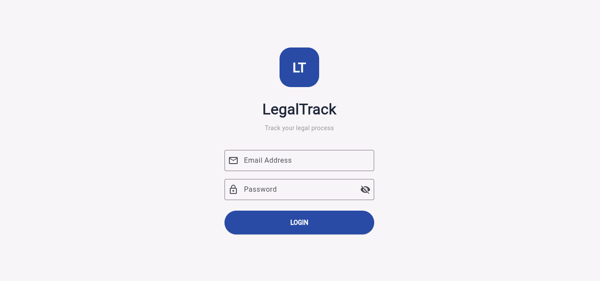
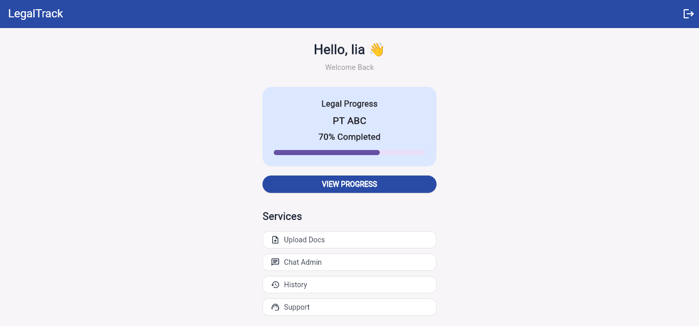
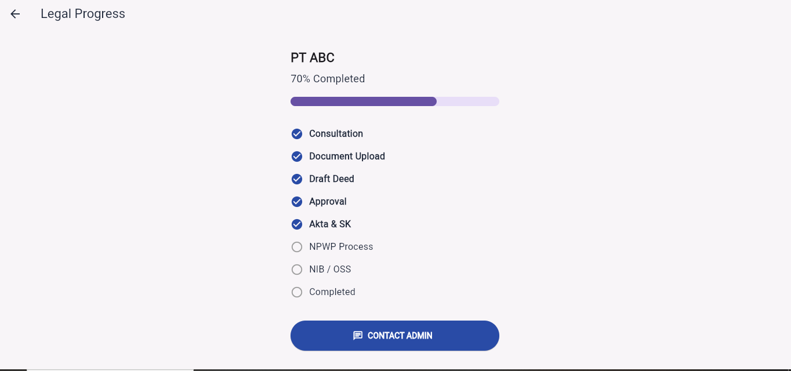
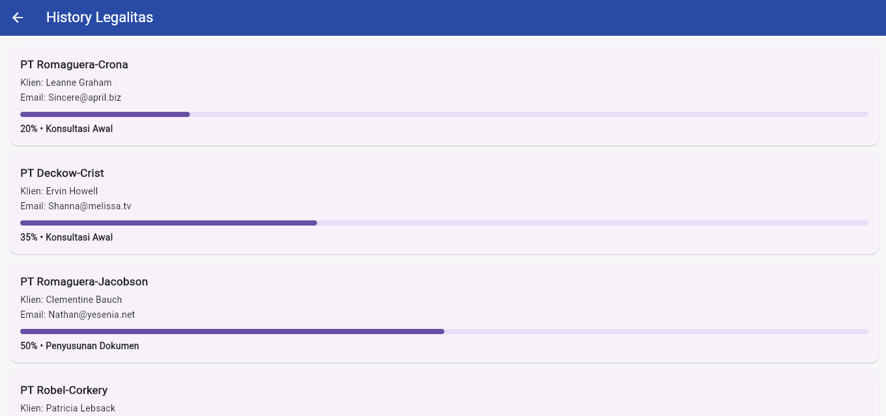
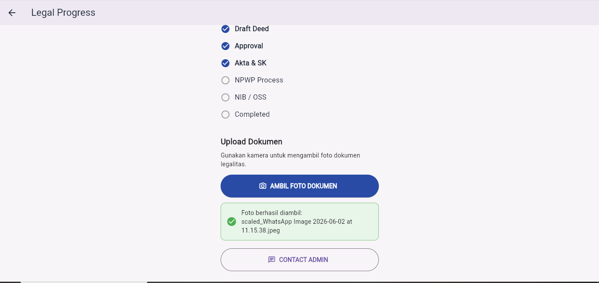

# LegalTrack Mobile App

## Deskripsi Aplikasi

LegalTrack adalah aplikasi mobile berbasis Flutter yang membantu klien memantau proses pengurusan legalitas usaha secara digital.

Satu akun klien dapat digunakan untuk memantau beberapa layanan legalitas, seperti pendirian PT, perubahan akta, pendaftaran merek, NIB/OSS, dan layanan lainnya.

Aplikasi ini merupakan pengembangan dari desain UI/UX LegalTrack pada Ujian Tengah Semester dan dikembangkan menjadi aplikasi yang lebih fungsional pada Ujian Akhir Semester.

## Fitur Utama

- Login pengguna
- Penyimpanan status login menggunakan Shared Preferences
- Halaman Home
- Detail progres legalitas PT ABC
- Daftar riwayat legalitas dari REST API
- Upload dokumen menggunakan Camera/Image Picker
- Logout pengguna
- State management menggunakan Provider
## Teknologi yang Digunakan

- Flutter
- Provider
- HTTP
- SharedPreferences
- Image Picker
- Material Design

## Alur Aplikasi

1. Klien melakukan login.
2. Status login disimpan menggunakan Shared Preferences.
3. Klien masuk ke halaman Home.
4. Menu View Progress menampilkan detail proses legalitas PT ABC.
5. Menu History menampilkan beberapa layanan legalitas milik klien.
6. Data pada menu History diambil dari REST API publik sebagai simulasi.
7. Menu Upload Docs menggunakan Image Picker untuk mengambil atau memilih foto dokumen.

## Software Architecture

Aplikasi menerapkan arsitektur MVC dengan pemisahan folder:

```text
lib/
├── controllers/
│   └── app_controller.dart
├── models/
│   └── legal_progress.dart
├── services/
│   └── api_service.dart
├── views/
│   ├── login_page.dart
│   ├── home_page.dart
│   ├── progress_page.dart
│   └── api_history_page.dart
└── main.dart
```

## Implementasi Fitur Flutter

### 1. State Management (Provider)

Aplikasi menggunakan Provider dan ChangeNotifier melalui AppController untuk mengelola state aplikasi seperti:

- Login pengguna
- Status loading
- Data progress legalitas
- Upload dokumen

Implementasi:
- ChangeNotifier
- ChangeNotifierProvider
- Consumer
- context.watch()
- context.read()

### 2. API Integration

Aplikasi menggunakan package HTTP untuk mengambil data legalitas dari REST API.

Endpoint simulasi:

`https://jsonplaceholder.typicode.com/users`

Implementasi:
- HTTP GET Request
- JSON Parsing
- Menampilkan data legalitas pada halaman History
- Menggunakan package `http`

### 3. Local Storage

Aplikasi menggunakan SharedPreferences untuk menyimpan:

- Status login
- Email pengguna

Sehingga pengguna tetap login saat aplikasi dibuka kembali.
Implementasi menggunakan package `shared_preferences`.

### 4. Mobile Features

Aplikasi menggunakan Image Picker untuk mengunggah dokumen legalitas.

Implementasi:
- Ambil foto dokumen
- Pilih gambar dari perangkat
- Menampilkan nama file yang berhasil dipilih
- Menggunakan package `image_picker`

## Screenshot Implementasi

### Login


### Home


### Progress Legalitas


### API History


### Upload Dokumen
hir Semester (UAS) mata kuliah Mobile Programming dan dapat dikembangkan lebih lanjut menjadi aplikasi production-ready.
